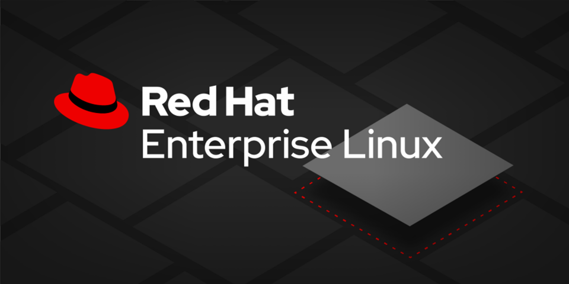

# RHEL9 Learning Program

<br>

## 项目概览

**RHEL9学习计划** 是一个全面、深入的 Red Hat Enterprise Linux (RHEL) 系统管理、自动化、安全和性能优化的学习与实践项目。本计划旨在通过系统化的学习路径，帮助用户从RHEL基础知识逐步进阶到高级管理、自动化运维、云原生集成以及架构设计等专家级水平。

## 项目目标

*   **系统化学习：** 提供一个结构化的90天学习路线，覆盖RHEL的各个方面。
*   **实践导向：** 强调动手实践，每个“天”都包含具体的任务和操作步骤。
*   **全面覆盖：** 涵盖RHEL基础、网络、存储、安全、性能、自动化、虚拟化、容器化、云集成、高可用性、故障排除等。
*   **DevOps与云原生：** 融入DevOps理念和云原生技术，适应现代IT运维趋势。
*   **专家级进阶：** 旨在帮助用户达到RHEL架构师或平台工程师的专业水平。

## 核心内容亮点

*   **90天学习路线：** 详细规划了从Day 1到Day 90的每日学习任务和知识点。
*   **自动化实践：** 深入学习Ansible，包括高级Playbook、Roles、Vault以及与Tower/AWX的集成。
*   **安全强化：** 涵盖SELinux、PAM、审计、内核安全、容器安全、零信任网络和供应链安全。
*   **性能优化：** 从系统级到应用级，包括CPU、内存、I/O、网络、JVM和数据库调优。
*   **云集成：** 探索RHEL在AWS、Azure、GCP等主流云平台上的部署与管理。
*   **容器化与虚拟化：** 掌握Podman、Buildah、Kubernetes、OpenShift、KVM、KubeVirt等技术。

## 项目目录结构

```
RHEL9-Learning-Program/
├── docs/                    # 所有文档的根目录
│   ├── daily_plans/         # 每日优化计划文档（Day_01_... Day_90_...）
│   │   ├── Day_01_Optimized_RHEL_Plan.md
│   │   ├── Day_02_Optimized_RHEL_Plan.md
│   │   └── ...
│   │   └── Day_90_Optimized_RHEL_Plan.md
│   ├── manual_vm_deployment/ # 虚拟机手动部署相关文档
│   │   └── ...
│   └── README.md            # `docs`目录的README，说明文档结构和如何使用
├── ISO/                     # 存放ISO镜像
│   ├── rhel-9.6-x86_64-dvd.iso
│   ├──README.md
├── Screenshots/             # 存放所有截图
│   └── day0/                # 按日期或主题分类的截图子目录
│       └── ...
├── Scripts/                 # 存放所有脚本文件（PowerShell, Shell脚本等）
│   ├── check-day0.ps1
│   ├── Day0-Provision.ps1
│   └── ...
├── VMs/                     # 存放虚拟机配置文件和磁盘文件
│   ├── desktop9/
│   │   └── ...
│   ├── node9/
│   │   └── ...
│   └── server9/
│       └── ...
├── LICENSE                  # 项目的许可证文件
├── README.md                # 项目主README文件
```

## 如何使用本计划

所有每日学习计划的详细内容都存放在 `docs/daily_plans/` 目录下。您可以按照日期顺序逐一学习和实践。

1.  **克隆仓库：**
    ```bash
    git clone https://github.com/flyxm/RHEL9-Learning-Program.git
    cd RHEL9-Learning-Program
    ```
2.  **浏览文档：**
    *   从 `docs/daily_plans/Day_01_Optimized_RHEL_Plan.md` 开始。
    *   查阅 `docs/README.md` 以了解文档目录的详细结构。

## 先决条件

*   运行RHEL 9的虚拟机或物理机（推荐使用虚拟机，如VMware Workstation, VirtualBox）。
*   具备基本的Linux命令行操作知识。
*   对虚拟化和网络有初步了解。

## 贡献

我们欢迎并鼓励社区贡献！如果您有任何改进建议、发现错误或想添加新的内容，请参阅我们的 [CONTRIBUTING.md](CONTRIBUTING.md) 文件。

## 许可证

本项目采用 [MIT License](LICENSE) 开放源代码。

---

**版权所有 © 2025 [flyxm]**